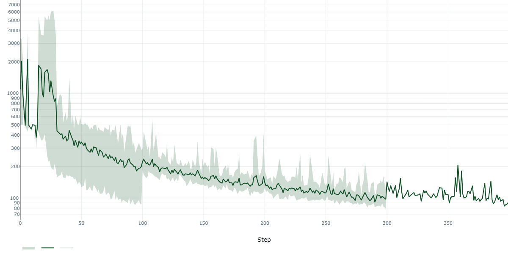
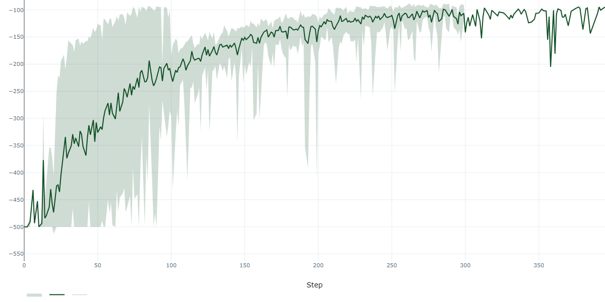
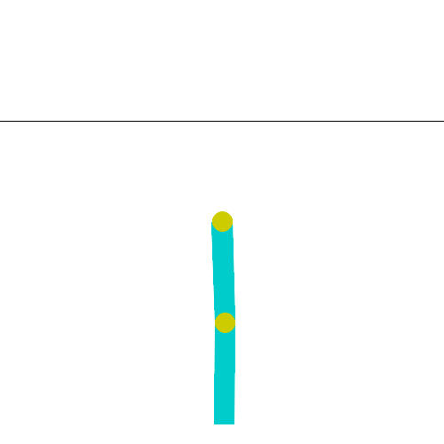

# Results for Acrobot-v1

This document summarizes the results for the Acrobot-v1 environment.

## Performance Graphs

<table>
  <tr>
    <td align="center"><b>Average Episode Length</b><br></td>
    <td align="center"><b>Average Episode Reward</b><br></td>
  </tr>
</table>

<p align="center">
  
</p>

## Commands

### Test Model Interactively

Use the following command to test the agent interactively without creating a video.

```bash
python src/test_model.py --model-path results/Acrobot-v1/Acrobot-v1-model.pt --model-string mlp_large --env Acrobot-v1 --interactive --episodes 10
```

### Train Model

The following command can be used to train a new agent with a similar configuration as the one provided. The hyperparameters are based on the `gridsearch.py` configuration.

```bash
python src/training.py \
    --env Acrobot-v1 \
    --network mlp_large \
    --policy epsilon_greedy \
    --epsilon 1.0 \
    --epsilon-end 0.01 \
    --learning-rate 0.0001 \
    --device cuda \
    --envs-count 5 \
    --discount 0.99 \
    --collect-steps 200 \
    --replay-buffer-size 50000 \
    --epochs 300 \
    --optim-steps 250 \
    --batch-size 256 \
    --prewarm 5000 \
    --target-update-every 20 \
    --run-name Acrobot-v1-training
```

### Test Model and Generate Video

Use the following command to test the agent and generate a video of its performance.

```bash
python src/test_model.py --model-path results/Acrobot-v1/Acrobot-v1-model.pt --model-string mlp_large --env Acrobot-v1 --episodes 5 --output results/Acrobot-v1/Acrobot-v1_mlp_large.gif
```